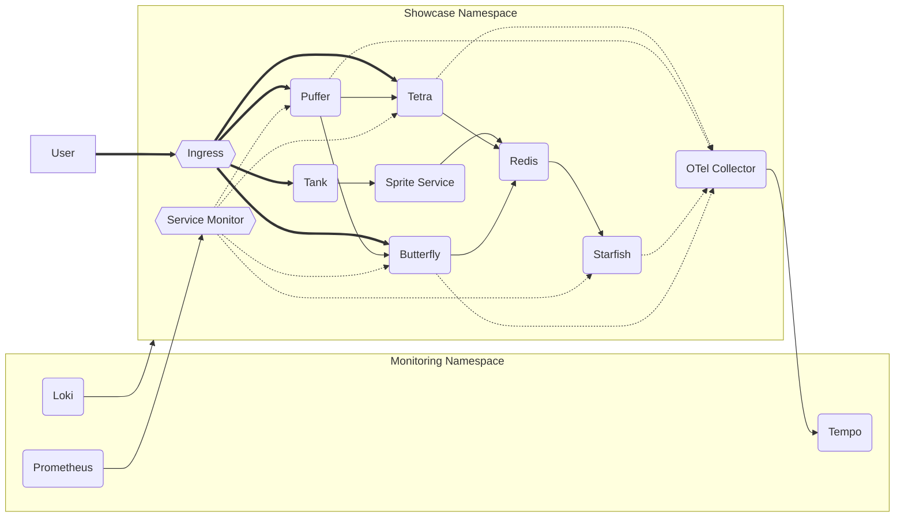

# aquarium

```mermaid
flowchart LR
    User ==> ing

    subgraph Monitoring Namespace
    lk(Loki)
    prom(Prometheus)
    tempo(Tempo)
    end

    subgraph sn [Showcase Namespace]
    ing{{Ingress}} ==> tank
    ing ==> tetra
    ing ==> butter
    ing ==> puffer

    tank(Tank) --> sprite(Sprite Service)
    sprite --> redis

    puffer(Puffer) --> tetra
    puffer --> butter

    tetra(Tetra) --> redis
    butter(Butterfly) --> redis

    redis(Redis) --> star    

    star(Starfish)

    otel(OTel Collector)
    tetra -.-> otel
    puffer -.-> otel
    star -.-> otel
    butter -.-> otel

    sm{{Service Monitor}} -.-> tetra
    sm -.-> puffer
    sm -.-> butter
    sm -.-> star
    end

    lk --> sn
    prom --> sm
    otel --> tempo
```